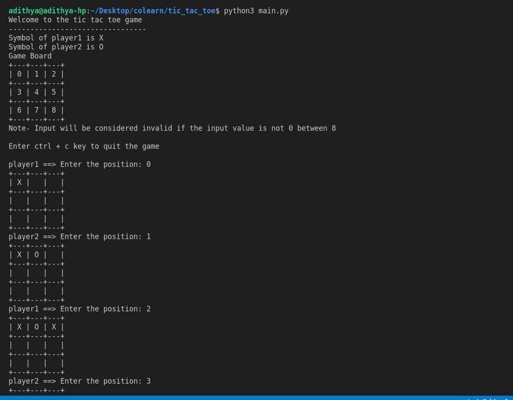
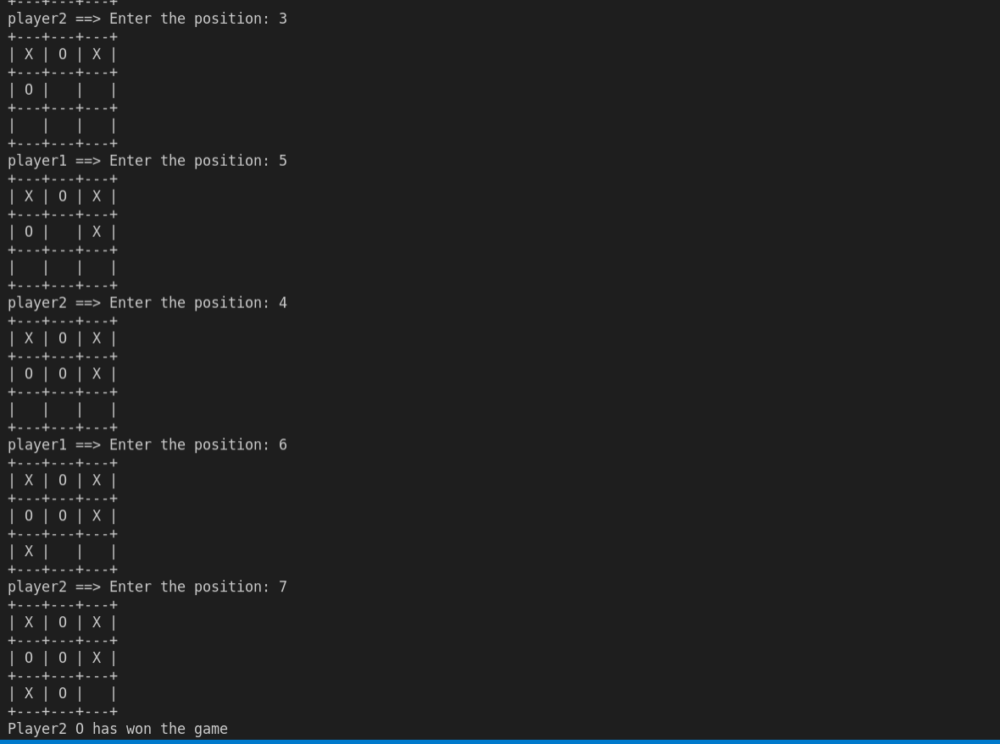

# tic_tac_toe

**Project**: Tic Tac Toe  

**Description**: A Simple Tic Tac Toe game with a command-line interface built in python. To know more about the Game [info](https://en.wikipedia.org/wiki/Tic-tac-toe)

**Status**: The Current version of the game enables only two manual players to play in the game [CHANGELOG](changelog.md).

**Screenshot**:

## Dependencies 

Python - 3.8.5

## Installation
- Clone a project 
- Get into the project directory in terminal
- Then execute this command to start the game **python3 main.py**

